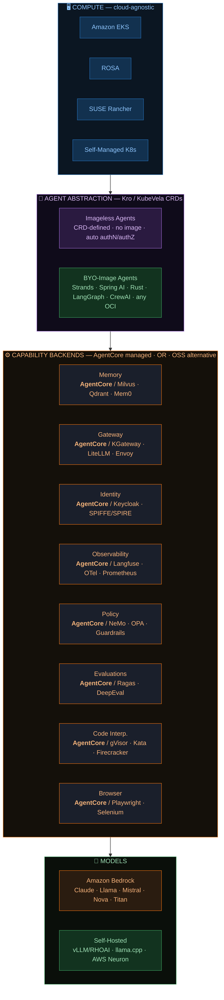

# Open Agentic Platform (OAP) on Amazon EKS

**A complete, production-shaped platform for building, running, securing, and observing AI agents on
Amazon EKS — installed with one command.**

OAP turns a set of EKS clusters into an agent platform: a place where a team can onboard a model,
declare an agent as a Kubernetes resource, give it tools (MCP), memory, a browser, and a code
interpreter, wire multiple agents together (A2A), secure every hop with real identity, and watch it
all through end-to-end traces — entirely via GitOps. It ships with a hands-on workshop and two
flagship patterns: a **multi-agent financial-services** system and the **Dark Factory** autonomous
coding pipeline running in hardware-isolated micro-VM sandboxes.

Everything is declarative and GitOps-driven (ArgoCD + Crossplane + KubeVela). You describe intent;
the platform reconciles it across a hub and any number of spoke clusters.

---

## Platform at a glance

Agent workloads sit on a layered stack — **Agent Platform Capabilities (APC)** on top of a
platform-engineering foundation, all on Amazon EKS Auto Mode:

```mermaid
flowchart TB
    subgraph WL["🤖 AGENT WORKLOADS"]
        direction LR
        w1[Financial Advisor]:::wl
        w2[K8s Ops Agent]:::wl
        w3[Multi-Tool Agent]:::wl
        w4["Custom Agents (BYOA)"]:::wl
    end

    subgraph APC["⚡ AGENT PLATFORM CAPABILITIES (OAP)"]
        direction LR
        a1[Model as a Service]:::cap
        a2[Agent Identities]:::cap
        a3[Agent Gateway]:::cap
        a4[Agent Isolation]:::cap
        a5[Agent Runtime]:::cap
        a6[Agent Lifecycle]:::cap
        a7[Agent Memory]:::cap
        a8[Agent Browser]:::cap
        a9[Agent Code Interpreter]:::cap
        a10[Agent Observability]:::cap
        a11[Agent Evaluation]:::cap
    end

    subgraph PE["🛠️ PLATFORM ENGINEERING"]
        direction LR
        p1[Developer Portal]:::op
        p2[Identity & Access]:::op
        p3[Infra as Code]:::op
        p4[Continuous Delivery]:::op
        p5[Workflow Orchestration]:::op
        p6[Service Discovery]:::op
        p7[Code / Config / Artifact / Secret Repos]:::app
    end

    XCUT["🔎 Observability  ·  🔐 Security & Governance  ·  ✍️ Signing"]:::xcut
    EKS["☁️ COMPUTE PLATFORM — Amazon EKS Auto Mode  ·  AWS Cloud"]:::eks

    WL --> APC --> PE --> XCUT --> EKS

    classDef wl fill:#6b3fa0,stroke:#4a2b70,color:#fff,font-weight:bold;
    classDef cap fill:#ec7211,stroke:#c85d0e,color:#fff,font-weight:bold;
    classDef op fill:#232f3e,stroke:#0f1b2a,color:#fff;
    classDef app fill:#2570b8,stroke:#1a4d80,color:#fff;
    classDef xcut fill:#3a7fc4,stroke:#255a94,color:#fff,font-weight:bold;
    classDef eks fill:#0f1b2a,stroke:#000,color:#fff,font-weight:bold;
    style WL fill:#f3ecfa,stroke:#6b3fa0,color:#4a2b70
    style APC fill:#fdf0e3,stroke:#ec7211,color:#c85d0e
    style PE fill:#eef1f5,stroke:#232f3e,color:#232f3e
```



---

## Why OAP

- **Agents as first-class Kubernetes resources** — `kind: Agent`, `kind: RemoteMCPServer`. Declare,
  version, blue/green, and roll back agents like any other workload.
- **Batteries included** — model gateway, identity, tool gateway, runtime, memory, browser, code
  interpreter, observability, and hardware isolation are pre-wired addons, not homework.
- **Real security posture** — Keycloak OIDC with JWT-enforced client→agent, agent→tool, and
  agent→agent authorization, plus per-workload LLM identity. The "lethal trifecta" is designed out.
- **Runs the hard patterns** — multi-agent orchestration, and an autonomous coding factory where
  untrusted, code-writing agents run inside **Kata micro-VMs** next to your control plane, safely.
- **One-command install, GitOps forever after** — `task install` provisions the hub, spokes, and
  every capability; after that, git is the source of truth.

---

## Quick Start

### Prerequisites

- AWS account with Amazon Bedrock access
- [Task](https://taskfile.dev), `kubectl`, Helm 3.x, AWS CLI, `yq`
- Podman or Docker (for the Kind-based bootstrap)
- A domain with an ACM cert + Route53 zone (ingress), and IAM Identity Center (ArgoCD SSO)

### Install

```bash
# 1. Configure
cp config.yaml config.local.yaml
# Edit config.local.yaml with your AWS / domain / SSO values

# 2. Install everything (platform + spokes + agentic capabilities)
task install
```

That's it. The installer bootstraps from Kind, provisions an EKS **hub** cluster, deploys the base
platform (ArgoCD, Crossplane, observability), provisions optional **spoke** clusters, then layers on
the agentic capabilities as ArgoCD-managed addons. The Kind bootstrap is destroyed once the hub is
self-managing.

---

## Agent Platform Capabilities (APC)

Each capability is a GitOps addon (`gitops/addons/charts/<name>`), gated per cluster via ArgoCD
ApplicationSets. Status reflects the current reference deployment.

| Capability | Delivered by | Status | What it gives you |
|---|---|---|---|
| **Model as a Service** | `bifrost` (platform) · `litellm` (workshop) | ✅ | LLM gateway to Bedrock with routing, fallbacks, rate limiting, caching, cost tracking. Onboard a model declaratively. |
| **Agent Identities** | `agent-gateway` + Keycloak | ✅ | OIDC identities for agents, users, and MCP clients (`platform` realm). |
| **Agent Gateway** | `agent-gateway`, `gateway-api-crds` | ✅ | A2A + MCP gateway with JWT-auth policies enforced on every call. |
| **Agent Runtime** | `crossplane-agentcore` | ✅ | Crossplane compositions for Amazon Bedrock AgentCore (`agentruntimes` CRD). |
| **Agent Lifecycle** | `oam-agent-components` + KAgent | ✅ | Declarative `Agent` CRDs, KubeVela OAM components, blue/green via ArgoCD. |
| **Agent Observability** | `otel-collector`, `langfuse`, Jaeger, AMP, AMG | ✅ | End-to-end traces (user→agent→tool→agent), LLM traces/cost, metrics + dashboards. |
| **Agent Memory** | `crossplane-agentcore` | ⚠️ CRD ready | `memories.*` CRDs registered; wire an instance for persistent memory. |
| **Agent Browser** | `crossplane-agentcore` | ⚠️ CRD ready | Managed headless browser resource for agents that browse. |
| **Agent Code Interpreter** | `crossplane-agentcore` / sandbox | ⚠️ CRD ready | Sandboxed code execution for agents. |
| **Agent Isolation** | `agent-sandbox` | ✅ (V2) | **Kata + Cloud Hypervisor micro-VMs** — hardware-isolated, credential-less sandboxes for untrusted agent code. |
| **Agent Evaluation** | (planned) | ⬜ | Eval tooling (AgentCore Evals / RAGAS) — roadmap. |

**Gateway note:** the platform ships **Bifrost** as the enabled AI gateway (per-workload virtual
keys, model routing); **LiteLLM** is included as an alternative chart and is the gateway used in the
workshop teaching path. Both front Amazon Bedrock.

---

## Provisioning & Topology

OAP uses a **hub + spokes** model, provisioned declaratively:

- **Hub cluster** — runs ArgoCD, Crossplane, the platform control plane, and (by default) the agentic
  capabilities. Crossplane on the hub provisions the spokes.
- **Spoke clusters** (`dev`, `prod`, …) — workload environments; agentic addons deploy to them
  automatically based on their `environment` label.
- **Kind bootstrap** — a throwaway local cluster that stands up the hub, then self-destructs.

Addons are targeted through a layered ApplicationSet model in `gitops/addons/`:

```
bootstrap/default/addons.yaml     # master catalog: every addon, its chart path + selector
default/addons/                   # values applied to all clusters
environments/<env>/addons         # per-environment overrides (e.g. control-plane)
clusters/<clusterName>/addons     # per-cluster overrides (e.g. hub)
```

Enable/disable capabilities per environment via `gitops/overlays/environments/<env>/enabled-addons.yaml`:

```yaml
# gitops/overlays/environments/dev/enabled-addons.yaml
enabledAddons:
  agent_platform: true    # deploy agentic capabilities to dev
  bifrost: true
  agent_sandbox: true
```

### Configuration (`config.local.yaml`)

| Section | Key Fields | Description |
|---------|-----------|-------------|
| `platform` | `repo`, `ref` | Base platform repo (appmod-blueprints) + version |
| `aws` | `region`, `accountId`, `profile` | AWS settings |
| `hub` | `clusterName`, `kubernetesVersion` | Hub cluster config |
| `domain` | | Ingress domain (ACM cert + Route53 zone) |
| `identityCenter` | `instanceArn`, `region`, `adminGroupId` | SSO for ArgoCD |
| `agenticRepo` | `url`, `revision`, `basepath` | This repo's coordinates (for ArgoCD) |
| `spokes` | | Optional spoke clusters (below) |

```yaml
spokes:
  dev:  { region: us-west-2, kubernetesVersion: "1.35", vpcCidr: "10.1.0.0/16", autoMode: true }
  prod: { region: us-west-2, kubernetesVersion: "1.35", vpcCidr: "10.2.0.0/16", autoMode: true }
```

Spokes are provisioned via Crossplane from the hub. Fleet member definitions in `gitops/fleet/members/`
control spoke discovery.

---

## Commands

| Command | Description |
|---------|-------------|
| `task install` | Full install (platform + spokes + agentic) |
| `task platform:install` | Provision base EKS platform only |
| `task spokes:install` | Provision spoke clusters only |
| `task spokes:status` | Check spoke provisioning progress |
| `task agentic:install` | Deploy agentic capabilities only |
| `task status` | Show ArgoCD application status |
| `task upgrade` | Upgrade everything |
| `task destroy` | Remove agentic capabilities (keeps base platform) |
| `task spokes:destroy` | Delete spoke clusters |

---

## Architecture

```
┌──────────────────────────────────────────────────────────────┐
│  open-agentic-platform (this repo)                             │
│  config.local.yaml → task install                             │
└───────────────┬─────────────────────────────┬─────────────────┘
                │                             │
       ┌────────▼─────────┐         ┌────────▼──────────┐
       │ appmod-blueprints │         │ ArgoCD Application │
       │ (base platform)   │         │ (agentic addons)   │
       │ read-only clone   │         │ points to this repo│
       └────────┬─────────┘         └────────┬──────────┘
                │                             │
                ▼                             ▼
   ┌────────────────────────────────────────────────────────────┐
   │                     EKS HUB CLUSTER                         │
   │  ArgoCD (GitOps) · Crossplane (provisions spokes)          │
   │  Capabilities: Bifrost / LiteLLM · AgentGateway · Keycloak │
   │                Langfuse · Jaeger · OTEL · AMP / AMG        │
   │                AgentCore (Crossplane) · Kata sandboxes     │
   └───────────────┬─────────────────────────────┬─────────────┘
                   │                             │
          ┌────────▼────────┐           ┌────────▼────────┐
          │  spoke: dev     │           │  spoke: prod    │
          │  agent workloads│           │  agent workloads│
          └─────────────────┘           └─────────────────┘
```

---

## Workshop

`workshop/` is a hands-on path from zero to a secured, observable multi-agent system:

| Module | Description |
|--------|-------------|
| `00-initial-setup` | Bedrock + model gateway configuration (Model as a Service) |
| `01-first-agent` | Deploy your first agent as a CRD |
| `02-k8s-ops-agent` | A Kubernetes operations agent |
| `03-multi-tool-agent` | Onboard MCP tool servers and wire them to an agent |
| `04-multi-agents` | Financial-services multi-agent orchestration (A2A) |
| `05-observability` | Tracing, LLM observability, metrics, dashboards |

---

## Flagship Patterns

### Multi-Agent Financial Services (A2A)
A `financial-advisor` agent delegates to specialist agents (portfolio, market, risk) over the A2A
protocol — every hop authenticated through the gateway and traced through OTEL / Jaeger / Langfuse.
See `workshop/04-multi-agents/financial-services`.

### Dark Factory — autonomous coding in hardware-isolated sandboxes (V2)
The Dark Factory turns a **GitHub issue into a reviewed, merged PR, autonomously**:

1. A labeled issue triggers an **Argo Workflow** on the hub.
2. A coding agent (Claude Code or Kiro CLI) implements the change inside a **credential-less Kata
   micro-VM** — an untrusted, network-locked, hardware-isolated sandbox — and opens a PR.
3. The change is reviewed by the **real AWS DevOps Agent** (release readiness) and **AWS Security
   Agent** (OWASP / secrets / IAM / dependency risk), plus a holdout gate and `terraform validate` /
   ephemeral-namespace deploy tests — every step reporting onto the PR.
4. A human approves; a separate Argo workflow squash-merges and reaps the sandbox.

```mermaid
flowchart LR
    I["🏷️ GitHub issue<br/>labeled dark-factory"]:::gh --> S["Argo Sensor"]:::hub
    S --> R["df-run workflow"]:::hub
    R --> K["🔒 Kata micro-VM<br/>coder: Claude Code / Kiro<br/><i>credential-less · network-locked</i>"]:::vm
    K --> PR["🔀 Pull Request"]:::gh
    PR --> DV["AWS DevOps Agent<br/>release readiness"]:::agent
    DV --> SEC["AWS Security Agent<br/>OWASP · secrets · IAM"]:::agent
    SEC --> GATES["Holdout gate ·<br/>terraform validate ·<br/>deploy test"]:::hub
    GATES --> H{"👤 Human<br/>approve?"}:::human
    H -->|yes| M["df-merge-teardown<br/>squash-merge + reap VM"]:::hub
    M --> DONE["✅ Merged to main"]:::gh

    classDef gh fill:#1a1f2b,stroke:#6e7681,color:#e6edf3;
    classDef hub fill:#12314f,stroke:#2570b8,color:#8ec5ff;
    classDef vm fill:#2a1a40,stroke:#a06bd6,color:#d9b8f5;
    classDef agent fill:#14100a,stroke:#ec7211,color:#f6b27a,font-weight:bold;
    classDef human fill:#12331f,stroke:#3fa060,color:#9fe0b5;
```



It is the platform's proof that you can run untrusted, code-writing agents safely alongside a control
plane. See [`docs/dark-factory/`](docs/dark-factory/) and [`examples/dark-factory/`](examples/dark-factory/).

---

## Managed or open source — your choice, per capability

OAP is **CNCF-aligned and cloud-agnostic**. Every capability can be backed by an **Amazon Bedrock
AgentCore** managed service **or** an **open-source alternative** — same declarative manifest,
different backend. Agents are onboarded either **imageless** (CRD-defined, no container to build) or
**BYO-image** (any OCI image / SDK). The abstraction layer (Kro / KubeVela orchestrating Crossplane ·
ACK · OpenTofu) resolves your choice at deploy time.



### Capabilities → charts (in this repo)

| Addon chart | Capability |
|---|---|
| `bifrost`, `litellm` | Model as a Service / AI gateway |
| `agent-gateway`, `gateway-api-crds` | Agent Gateway + identity (A2A / MCP authz) |
| `crossplane-agentcore` | Runtime, Memory, Browser, Code Interpreter (Bedrock AgentCore) |
| `oam-agent-components` | Agent lifecycle (KubeVela OAM components) |
| `otel-collector`, `langfuse` | Observability (traces + LLM analytics) |
| `agent-sandbox` | Agent isolation (Kata + Cloud Hypervisor micro-VMs) |
| `dark-factory` | Autonomous coding pipeline (Argo Workflows + agents) |
| `application-sets` | ArgoCD ApplicationSet wiring |

---

## Roadmap

- **V2 (in progress):** agent sandboxes (✅ Dark Factory + Kata), full Memory / Browser / Code-Interpreter
  instances, self-service agent onboarding (Backstage).
- **V3:** AgentCore Gateway / Runtime extensions; agentic workflow engines (Camunda, Pega); evaluation
  tooling (AgentCore Evals / RAGAS).

---

## Documentation & Design

Design docs and open work items — check these before starting a new feature:

| Document | Covers | Open items |
|---|---|---|
| [`docs/architecture/`](docs/architecture/) | Agent identity & token exchange, platform architecture | — |
| [`docs/OBSERVABILITY.md`](docs/OBSERVABILITY.md) | Tracing, LLM observability, metrics/dashboards | — |
| [`docs/dark-factory/README.md`](docs/dark-factory/README.md) | Dark Factory design, flows, diagrams | — |
| [`docs/dark-factory/AGENT-INSTALL.md`](docs/dark-factory/AGENT-INSTALL.md) | Connecting the AWS DevOps + Security Agents | — |
| [`gitops/DEPLOYMENT.md`](gitops/DEPLOYMENT.md) | GitOps deployment runbook (ArgoCD bootstrap, addon enablement, Pod Identity) | LiteLLM Pod-Identity step superseded by declarative Crossplane in the bifrost chart |
| [`gitops/addons/charts/bifrost/DESIGN.md`](gitops/addons/charts/bifrost/DESIGN.md) | Bifrost AI Gateway + **per-workload Virtual Key** target design | ⚠️ `is_vk_mandatory` disabled — implement per-workload VK minting before enabling |
| [`platform/oam/DESIGN.md`](platform/oam/DESIGN.md) | KubeVela OAM `agent` / `mcp-server` ComponentDefinitions | — |
| [`applications/strands-agent-base/ARCHITECTURE.md`](applications/strands-agent-base/ARCHITECTURE.md) | Strands agent internals, gateway integration, A2A | References LiteLLM — superseded by Bifrost (`OpenAIModel` + `x-bf-vk`) |

## Resources

- [Amazon Bedrock](https://aws.amazon.com/bedrock) · [AgentCore](https://aws.amazon.com/bedrock/agentcore/)
- [Bifrost](https://github.com/maximhq/bifrost) · [LiteLLM](https://docs.litellm.ai) · [Langfuse](https://langfuse.com/docs)
- [Kata Containers](https://katacontainers.io) · [Argo Workflows](https://argoproj.github.io/workflows/)
- [appmod-blueprints](https://github.com/aws-samples/appmod-blueprints) (base platform)
