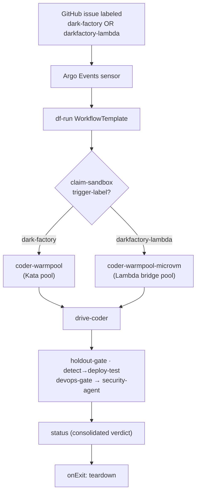
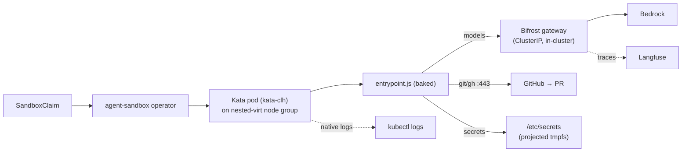
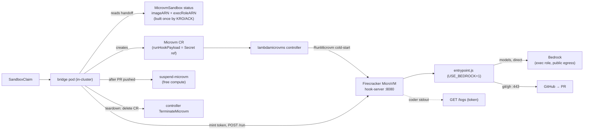
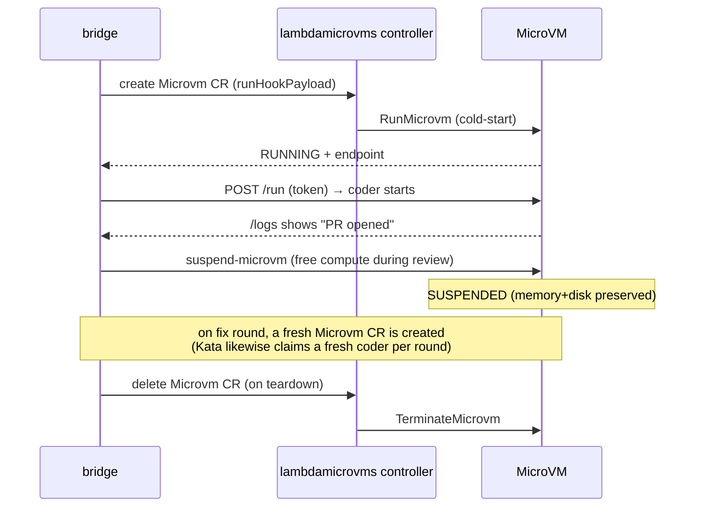
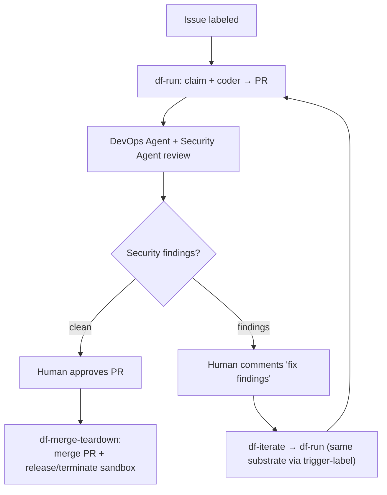

# Dark Factory — Substrate Diagrams (Kata vs Lambda MicroVM)

Visual companion to [`SUBSTRATE-BENCHMARK.md`](./SUBSTRATE-BENCHMARK.md). All diagrams are
Mermaid (render on GitHub).

---

## 1. Shared pipeline, substrate-branched claim

Both substrates run the **same `df-run` WorkflowTemplate**. The only branch is which warm pool
`claim-sandbox` claims from — decided by the issue's trigger label.

The DAG has **no MicroVM-specific node** — Lambda suspend/resume lives in the bridge (§4), so the
Kata graph is 100% clean.

---

## 2. Kata micro-VM substrate (Flow B)

- Pre-warmed pod → **instant claim**.
- Workspace is a **mounted writable volume**; logs are native; models via Bifrost (with Langfuse
  traces). Node pool runs continuously.

---

## 3. Lambda MicroVM substrate (Flow D)

- `RunMicrovm` **cold-start per session** (~90s); no node pool.
- No cluster network dependency — **Bedrock-direct**. Logs via `/logs`. Bridge suspends the VM
  after the PR, terminates on teardown.

---

## 4. Lambda suspend / resume (bridge-owned, not a DAG step)

---

## 5. End-to-end lifecycle (issue → PR → fix → merge) — both substrates

The loop is identical for both substrates; `df-iterate` reads the originating issue's label to
route the fix round back to the **same** substrate (Kata pool or Lambda pool).

---

## Legend / key facts

- **Warm pool:** Kata = ready pods (instant); Lambda = bridge pods that RunMicrovm on claim.
- **LLM:** Kata → Bifrost (traced in Langfuse); Lambda → Bedrock-direct (exec role).
- **Workspace:** Kata → mounted volume; Lambda → `/tmp/workspace` (read-only rootfs).
- **Logs:** Kata → `kubectl logs`; Lambda → `/logs` endpoint (+ build logs in CloudWatch).
- **Teardown:** Kata → release claim; Lambda → delete `Microvm` CR → TerminateMicrovm.
