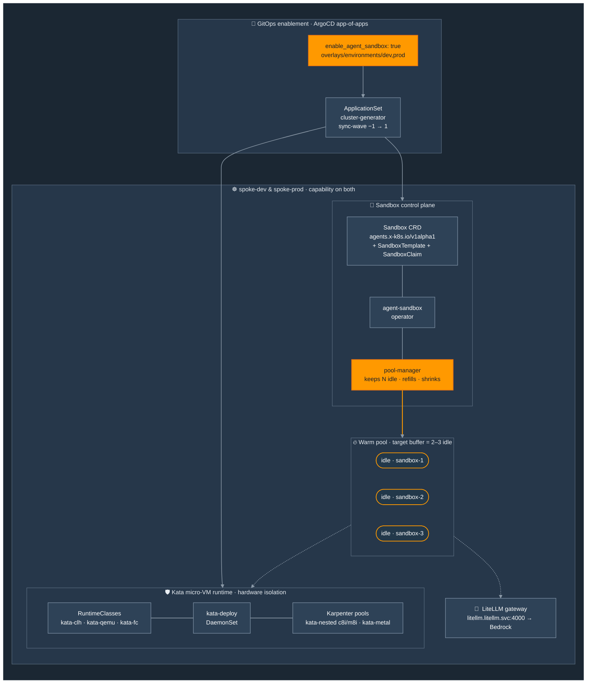
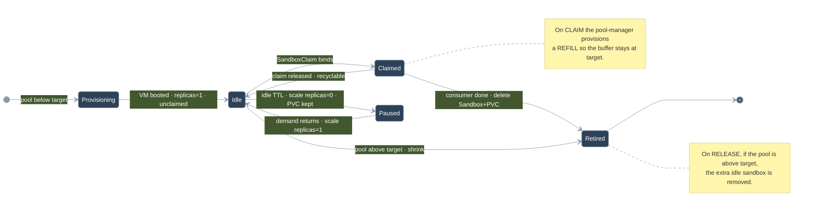

# Flow A — Agent Sandbox Capability (permanent platform feature)

The **Agent Sandbox** capability ships as a first-class agent-platform GitOps addon. When the
platform is deployed, it stands up the Kata (Cloud Hypervisor) micro-VM runtime, the `Sandbox`
CRD + operator, and a **warm pool** of pre-provisioned, hardware-isolated sandboxes kept ready by
a pool-manager controller. This is independent of the Dark Factory — it is the reusable isolation
substrate any agent workload can claim.

---

## A.1 — Capability architecture

---

## A.2 — Warm-pool cycling (claim ↔ refill ↔ shrink)

The pool-manager keeps a steady buffer of idle sandboxes so a consumer (e.g. the Dark Factory)
binds to a **ready** VM instantly instead of paying cold-start. Idle sandboxes use the `Sandbox`
`replicas: 0/1` **scale subresource**, so "idle" is cheap.

