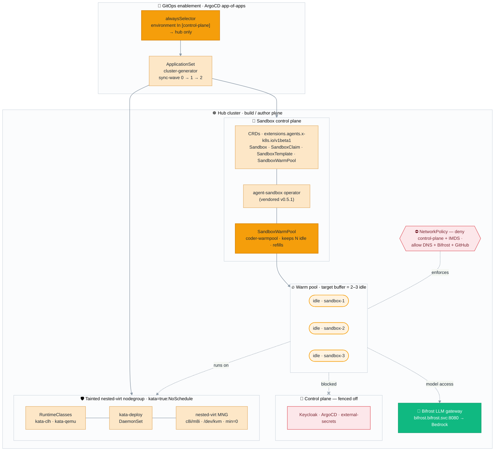
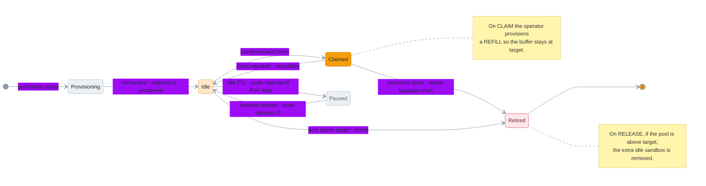

# Flow A — Agent Sandbox Capability (permanent platform feature)

The **Agent Sandbox** capability ships as a first-class agent-platform GitOps addon. When the
platform is deployed, it stands up the Kata (Cloud Hypervisor) micro-VM runtime, the `Sandbox`
CRD + operator, and a **warm pool** of pre-provisioned, hardware-isolated sandboxes kept ready by
the operator's native `SandboxWarmPool`. This is independent of the Dark Factory — it is the
reusable isolation substrate any agent workload can claim.

> **Hosted on the hub cluster** — the build/author plane, co-located with Argo Workflows so Flow B
> orchestrates the pool single-cluster. Because the hub runs EKS Auto Mode (which can't host Kata)
> and the fleet control plane (Keycloak/ArgoCD/external-secrets), the capability requires a
> **dedicated tainted nested-virt nodegroup** and **control-plane egress lockdown** — see
> [README §3](../README.md#3-flow-a--agent-sandbox-capability-permanent-platform-feature) and
> [§10](../README.md#10-security-model).

> Palette: **gray** = neutral · **orange** = active/warm · **green** = ready/verified ·
> **pink** = fenced-off control plane · dashed = feedback/enforcement.

---

## A.1 — Capability architecture

---

## A.2 — Warm-pool cycling (claim ↔ refill ↔ shrink)

The operator keeps a steady buffer of idle sandboxes so a consumer (e.g. the Dark Factory) binds to
a **ready** VM instantly instead of paying cold-start. Idle sandboxes use the `Sandbox`
`replicas: 0/1` **scale subresource**, so "idle" is cheap.

