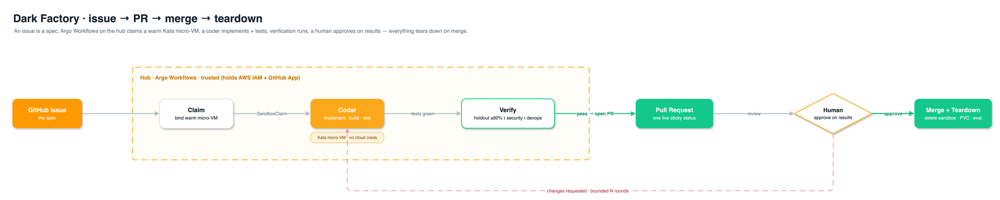
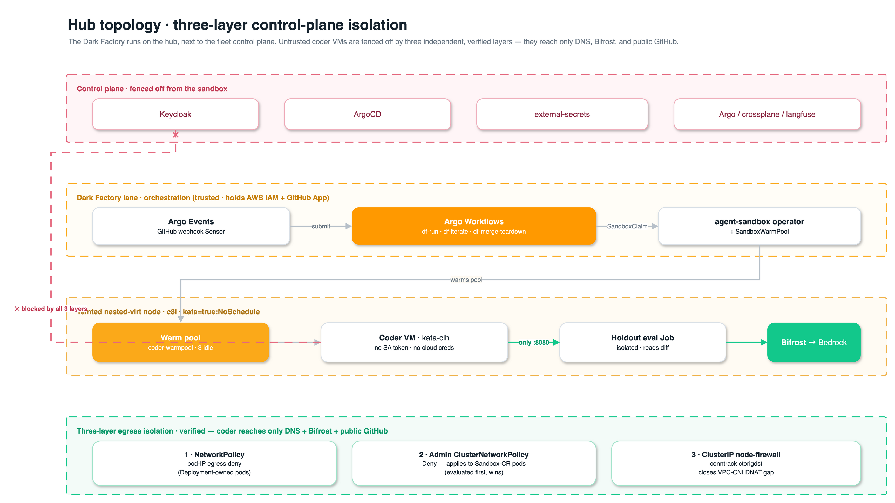

# Flow B — Dark Factory (issue → PR → merge → teardown)

A GitHub issue is a **spec**. On the **hub cluster**, **Argo Workflows** claims a warm Kata sandbox,
a pluggable coding assistant implements + tests the change and pushes a branch, the workflow opens a
PR and runs independent verification (holdout gate + AWS Security/DevOps review), a human approves on
**results**, and everything is torn down on merge. Autonomy **Level 3**: the human's only job is to
approve the merge.

> **Runs on the hub** — the build/author plane, co-located with Argo Workflows and the Flow A warm
> pool. Single-cluster orchestration: the workflow watches the coder pod and eval Job directly. See
> [README §2](../README.md#2-two-flows-at-a-glance) for *why the hub, not a spoke*, and
> [§10](../README.md#10-security-model) for the control-plane isolation that makes it safe.

> 🎨 Diagrams are editable draw.io — sources in [`src/`](./src/), rendered PNGs in [`img/`](./img/).

---

## B.1 — End-to-end lifecycle

Issue → claim a warm micro-VM → coder implements + tests → verify → open PR with a live sticky
status → human approves on results → merge + teardown. A bounded feedback loop routes review
comments back to the coder.



*Edit: [`src/flow-b-lifecycle.drawio`](./src/flow-b-lifecycle.drawio)*

---

## B.2 — Hub topology & three-layer isolation

The Dark Factory shares a cluster with the fleet control plane, so untrusted coder VMs are fenced
off by **three independent, verified layers** — a standard NetworkPolicy (pod-IP egress), an
Admin-tier ClusterNetworkPolicy (applies to the Sandbox-CR-owned coder pods), and a ClusterIP
node-firewall (closes the EKS VPC-CNI DNAT gap). Net result: the coder reaches only DNS, Bifrost,
and public GitHub — never the control plane, node, or API server.



*Edit: [`src/flow-b-hub-topology.drawio`](./src/flow-b-hub-topology.drawio)*

---

## B.3 — Event-driven lifecycle

No long-running orchestrator. An **Argo Events Sensor** turns each GitHub webhook into a short-lived,
issue-keyed workflow (`df-run`, `df-iterate`, `df-merge-teardown`); durable state lives in the
retained workspace PVC + GitHub, not a parked process.


*Edit: [`src/flow-b-lifecycle-events.drawio`](./src/flow-b-lifecycle-events.drawio)*

---

## B.4 — The one sticky PR comment

The workflow maintains **one** comment, edited in place via a hidden marker — no comment spam. Until
tests are green there is no PR, so pre-PR status lives on the **issue**; from PR-open onward the
comment is the canonical board. Parallel review steps are serialized by a per-issue mutex.

```
## 🏭 Dark Factory — issue #42  ·  PR #128
✅ Claimed sandbox (hub)            12:01
✅ Branch df/issue-42               12:01
✅ Implement                        12:04
✅ Build + unit tests               12:07   📄 log
✅ PR opened  #128                  12:07
⏳ Security review…
⬜ DevOps review
⬜ Holdout gate (0/12)
⬜ Ready for review
```

Each stage links to raw logs / the Argo run / the Langfuse trace (**verifiability-by-citation**).
The PR **body** carries the final report: what changed, test results, holdout satisfaction %, and
the Security/DevOps findings.
