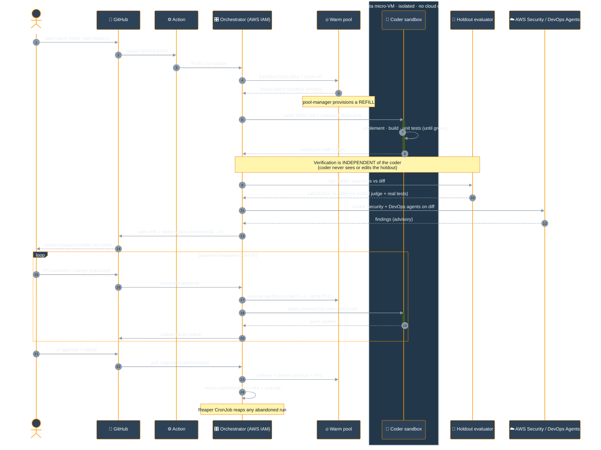
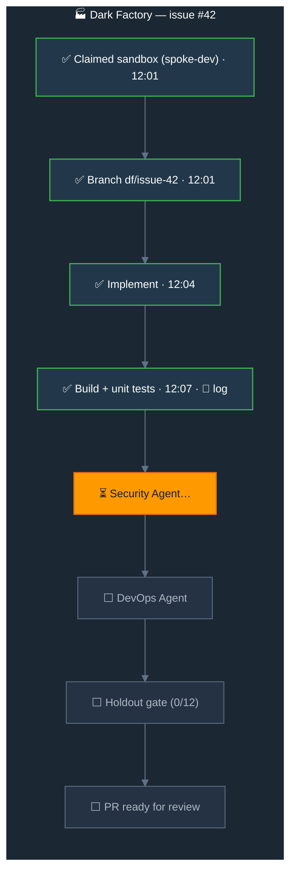

# Flow B — Dark Factory (issue → PR → merge → teardown)

A GitHub issue is a **spec**. The factory claims a warm sandbox on spoke-dev, a pluggable coding
assistant implements + tests the change, the orchestrator runs independent verification (holdout
gate + AWS frontier agents), a PR is opened with a **live-updating** status, a human approves on
results, and everything is torn down on merge. Autonomy **Level 3**: the human's only job is to
approve the merge.

---

## B.1 — End-to-end pipeline (lights-off assembly line)

```mermaid
%%{init: {'theme':'base','themeVariables':{
  'fontFamily':'Amazon Ember, Helvetica, Arial, sans-serif','fontSize':'13.5px',
  'primaryColor':'#2E4257','primaryBorderColor':'#7C8FA3','primaryTextColor':'#FFFFFF',
  'lineColor':'#8B99A7','clusterBkg':'#26374A','clusterBorder':'#5F7185'}}}%%
flowchart LR
    classDef canvas  fill:#1B2733,stroke:#1B2733,color:#FFFFFF;
    classDef band    fill:#26374A,stroke:#5F7185,color:#E8EDF2,stroke-width:1px;
    classDef node    fill:#2E4257,stroke:#7C8FA3,color:#FFFFFF,stroke-width:1.2px;
    classDef accent  fill:#FF9900,stroke:#EC7211,color:#161E2D,stroke-width:1.5px;
    classDef human   fill:#22384A,stroke:#FF9900,color:#FFFFFF,stroke-width:1.4px;
    classDef gate    fill:#2E4257,stroke:#FF9900,color:#FFFFFF,stroke-width:1.4px;

    subgraph CANVAS["  "]
    direction LR

        START(["🧾 Issue opened<br/>label: dark-factory"]):::accent

        subgraph T["① Trigger"]
            GHA["⚙️ GitHub Action<br/>gate on label<br/>mint short-TTL token"]:::node
        end

        subgraph O["② Orchestrate · spoke-dev · trusted (holds AWS IAM)"]
            ORCH["🎛️ Orchestrator<br/>key = issue-id<br/>claim · drive · report"]:::node
            CLAIM["🔒 SandboxClaim<br/>bind warm sandbox · pool refills"]:::node
            ORCH --> CLAIM
        end

        subgraph SBX["③ Code + self-test · Kata micro-VM · isolated (no cloud creds)"]
            CODER["🤖 Pluggable coder<br/>Claude Code | Kiro<br/>reads SPEC.md"]:::node
            IMPL["✍️ implement<br/>branch df/issue-N"]:::node
            BUILD["🔧 build + unit tests<br/>until green"]:::node
            CODER --> IMPL --> BUILD
        end

        subgraph V["④ Independent verification · orchestrator-driven (NOT the coder)"]
            HOLD["🎯 Holdout gate<br/>hidden scenarios · different-model judge<br/>+ executable tests · ≥90%"]:::gate
            SEC["🛡️ AWS Security Agent"]:::node
            DEV["🚀 AWS DevOps Agent"]:::node
            HOLD -.-> SEC -.-> DEV
        end

        subgraph P["⑤ Pull Request · live status"]
            PR["🔀 PR opened<br/>sticky comment ⏳→✅<br/>results + findings + logs"]:::node
        end

        subgraph H["⑥ Human · Level 3"]
            REVIEW{"Approve?<br/>reviews RESULTS"}:::human
            COMMENT["💬 PR comment<br/>resume sandbox · iterate<br/>bounded N rounds"]:::human
        end

        subgraph TD["⑦ Merge + teardown"]
            MERGE["✅ merge PR"]:::accent
            DESTROY["🧹 delete sandbox + PVC<br/>+ ephemeral test infra + eval job"]:::node
            MERGE --> DESTROY --> DONE(["🏁 done"]):::node
        end

        START ==> GHA ==> ORCH
        CLAIM ==> CODER
        BUILD ==> HOLD
        DEV   ==> PR
        PR    ==> REVIEW
        REVIEW -->|changes requested| COMMENT
        COMMENT -.->|new instruction| CODER
        REVIEW ==>|approve| MERGE
    end

    class CANVAS canvas
    class T,O,SBX,V,P,H,TD band
    linkStyle default stroke:#8B99A7,stroke-width:1.4px;
    linkStyle 7,8,9,10,11,12,15 stroke:#FF9900,stroke-width:2px;
```

---

## B.2 — Detailed sequence (who does what, and the trust boundary)

---

## B.3 — Live PR status (the sticky comment the human watches)

The orchestrator maintains **one** PR comment, edited in place as each stage completes — no comment
spam, one canonical surface (the pattern Copilot/Devin/Factory converge on).

