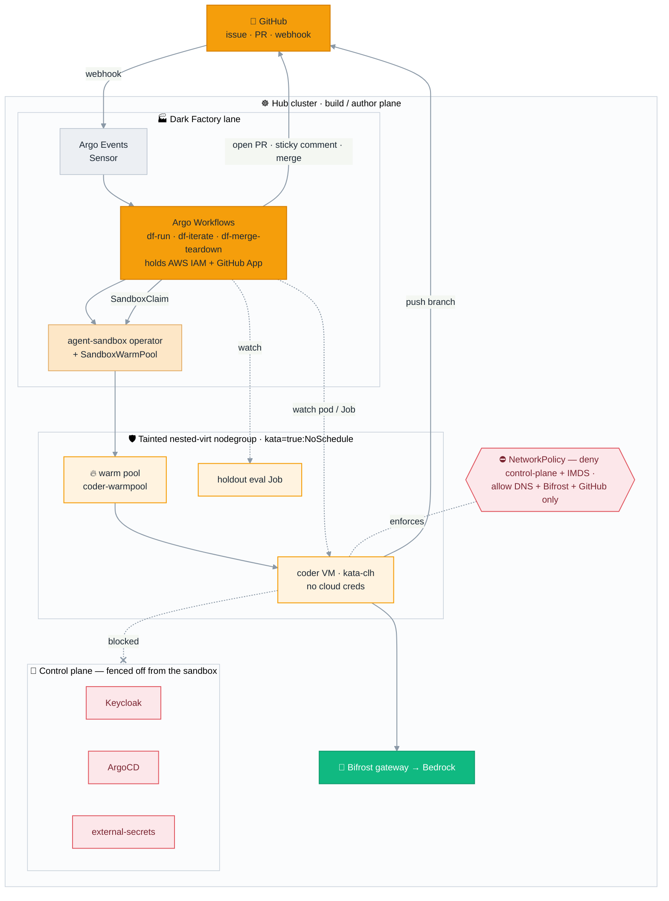
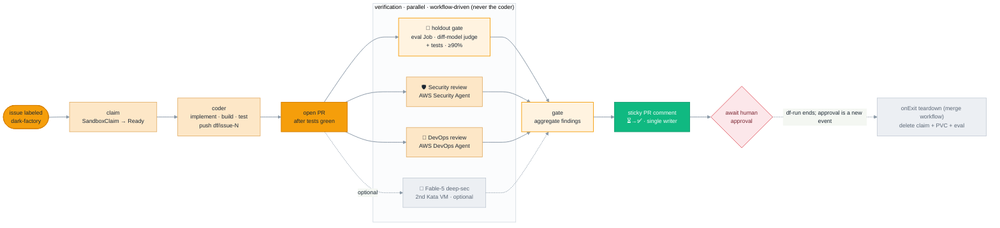
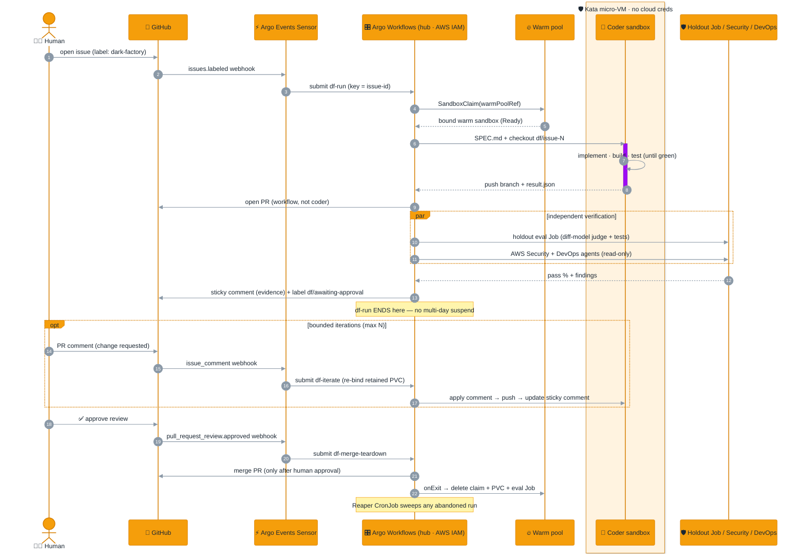
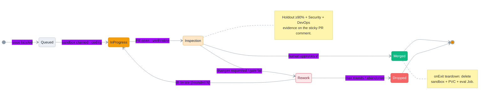
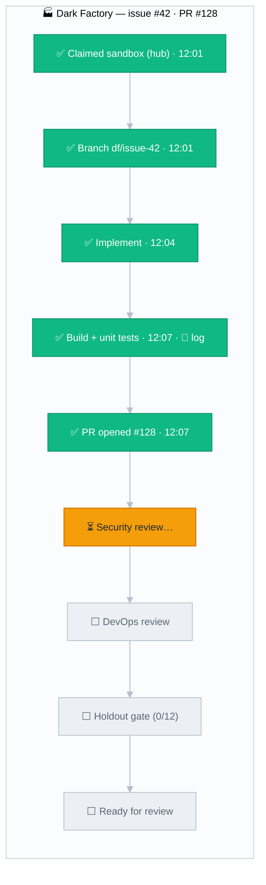

# Flow B — Dark Factory (issue → PR → merge → teardown)

A GitHub issue is a **spec**. On the **hub cluster**, **Argo Workflows** claims a warm Kata sandbox,
a pluggable coding assistant implements + tests the change and pushes a branch, the workflow opens a
PR and runs independent verification (holdout gate + AWS Security/DevOps review), a human approves on
**results**, and everything is torn down on merge. Autonomy **Level 3**: the human's only job is to
approve the merge.

> **Runs on the hub** — the build/author plane, co-located with Argo Workflows and the Flow A warm
> pool. Single-cluster orchestration: the workflow watches the coder pod and eval Job directly. See
> [README §2](../README.md#2-two-flows-at-a-glance) for *why the hub, not a spoke*, and
> [§10](../README.md#10-security-model) for the control-plane isolation that makes it safe.

> Diagrams use the Dark Factory palette: **gray** = neutral/queued · **orange** = active ·
> **green** = success/verified · **pink** = rework · **red** = fail/blocked · dashed = feedback loop.

---

## B.1 — Hub topology & isolation boundary

The Dark Factory lane and the hub's control-plane services share a cluster, so the isolation
boundary is explicit: coder VMs run **only** on a dedicated **tainted nested-virt nodegroup**, and a
**NetworkPolicy** denies egress to the control-plane services (Keycloak / ArgoCD / external-secrets /
Argo) and IMDS — allowing only DNS + Bifrost + GitHub.

---

## B.2 — The `df-run` DAG (claim → code → verify → PR → await approval)

All steps are **local to the hub**, so Argo watches pod/Job status directly and owner-references
cascade cleanup. Verification fans out in **parallel**; the coder never grades itself.

---

## B.3 — Event-driven lifecycle (Argo Events → short workflows keyed on issue-id)

Rather than one multi-day suspended workflow, each GitHub event submits a **short-lived workflow**.
Durable state lives in the retained workspace PVC + GitHub + a per-issue state ConfigMap.

---

## B.4 — Task lifecycle (what the human sees)

Mirrors the Dark Factory task-lifecycle model: neutral → active → verify → success, with the
rework/dropped branches.

---

## B.5 — The one sticky PR comment (single writer = the workflow)

The workflow maintains **one** comment, edited in place via a hidden marker — no comment spam. Until
tests are green there is no PR, so pre-PR status lives on the **issue**; from PR-open onward the
comment is the canonical board. Parallel review steps are serialized by a **per-issue mutex**.

